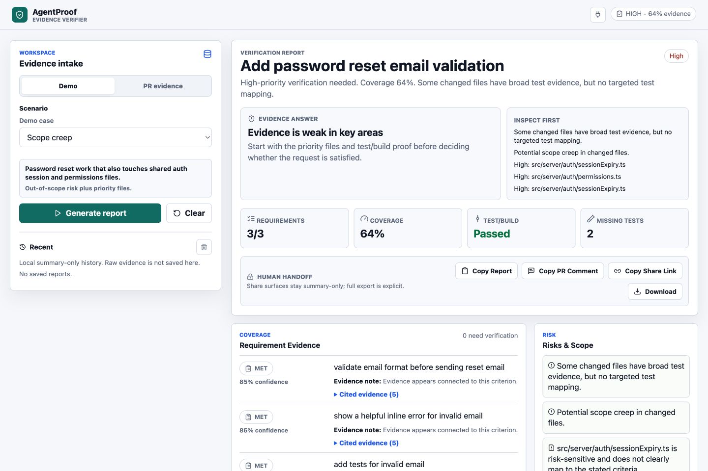
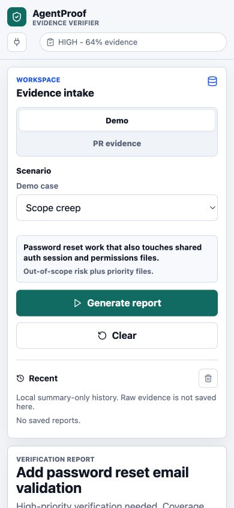

# Example Reports

These examples are generated from the public demo scenarios in the deployed AgentProof app. They are sanitized portfolio artifacts: they show report outcomes and reviewer signals without preserving raw production evidence, private tokens, or real user code.

Deployed demo:

https://agentproof-pearl.vercel.app

## Screenshots

Desktop reviewer workspace:

Mobile reviewer card:

## Scenario Summary

Captured from production on 2026-06-29.

| Scenario | Priority | Evidence coverage | Requirement status | Test/build | Main verifier signal |
| --- | --- | ---: | --- | --- | --- |
| Clean PR | Medium | 89% | 3 met, 1 partial | Passed | Mostly aligned requirement evidence with one partial criterion. |
| Scope creep | High | 64% | 3 met | Passed | Risk-sensitive auth/session files do not map to the stated task. |
| Missing tests | High | 36% | 4 partial | Unknown | Behavior files changed without targeted test proof. |
| Failed CI | Blocker | 27% | 3 partial | Failed | Failed execution evidence prevents treating the PR as proven. |
| Vague task | Medium | 15% | 1 unclear | Unknown | The original task is too vague for confident requirement mapping. |

## Clean PR

**Task:** Add password reset email validation.

**Expected reviewer takeaway:** The PR has strong evidence, but AgentProof still marks one requirement as partial instead of turning the report into an approval gate.

**Key signals:**

- Priority: medium
- Evidence coverage: 89%
- Test/build: passed
- Missing tests: none
- Scope creep: none detected
- Top risk: some requirements have only partial evidence

## Scope Creep

**Task:** Add password reset email validation.

**Expected reviewer takeaway:** Implementation and tests may be aligned, but unrelated auth/session files need inspection before trusting the agent-authored PR.

**Key signals:**

- Priority: high
- Evidence coverage: 64%
- Test/build: passed
- Missing-test paths: `src/server/auth/sessionExpiry.ts`, `src/server/auth/permissions.ts`
- Scope files: `src/server/auth/sessionExpiry.ts`, `src/server/auth/permissions.ts`
- Top risks: broad test evidence without targeted mapping; potential scope creep

## Missing Tests

**Task:** Add invoice CSV export.

**Expected reviewer takeaway:** Lint/typecheck are not enough proof for behavior changes. The reviewer should request targeted tests or evidence that the export behavior was exercised.

**Key signals:**

- Priority: high
- Evidence coverage: 36%
- Test/build: unknown
- Lint/typecheck: passed
- Missing-test paths: `src/billing/InvoiceExportButton.tsx`, `src/billing/exportInvoiceCsv.ts`
- Top risk: behavior changed without strong test evidence

## Failed CI

**Task:** Validate workspace invite emails.

**Expected reviewer takeaway:** Failed execution evidence blocks the report from calling requirements met, even when the diff looks related.

**Key signals:**

- Priority: blocker
- Evidence coverage: 27%
- Test/build: failed
- Missing-test path: `src/team/InviteMemberForm.tsx`
- Top risk: test/build execution failed, so the PR is not proven ready

## Vague Task

**Task:** Improve project dashboard.

**Expected reviewer takeaway:** AgentProof should not invent acceptance criteria. The right next action is to ask for a clearer task before trusting the PR.

**Key signals:**

- Priority: medium
- Evidence coverage: 15%
- Requirement status: unclear
- Test/build: unknown
- Missing-test paths: `src/dashboard/DashboardHome.tsx`, `src/dashboard/dashboardCopy.ts`
- Limitations: no CI/test logs; incomplete check status; at least one requirement needs human interpretation

## What These Examples Prove

- AgentProof produces distinct outcomes for clean, scope-creep, missing-test, failed-CI, and vague-task cases.
- Passing checks do not erase scope or missing-test risk.
- Failed execution evidence caps confidence and creates a blocker.
- Vague tasks stay unclear instead of being rewritten into invented proof.
- Share links, browser history, saved reports, and Slack payloads remain summary-only.
